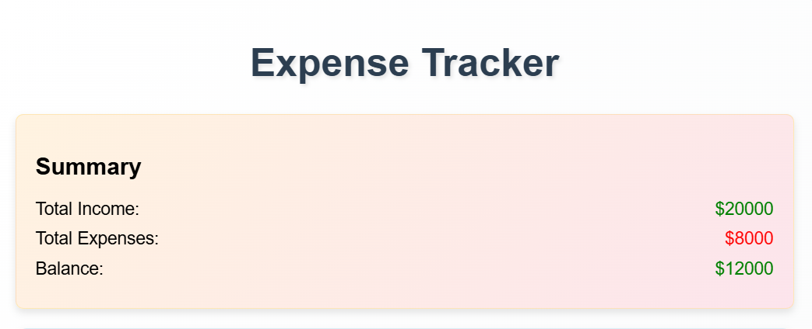
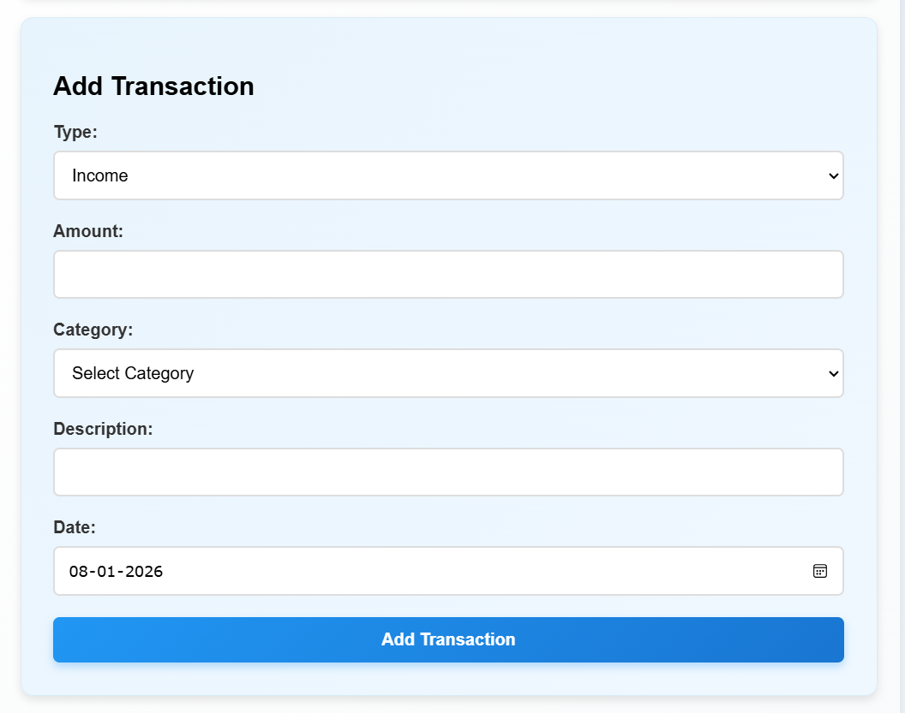
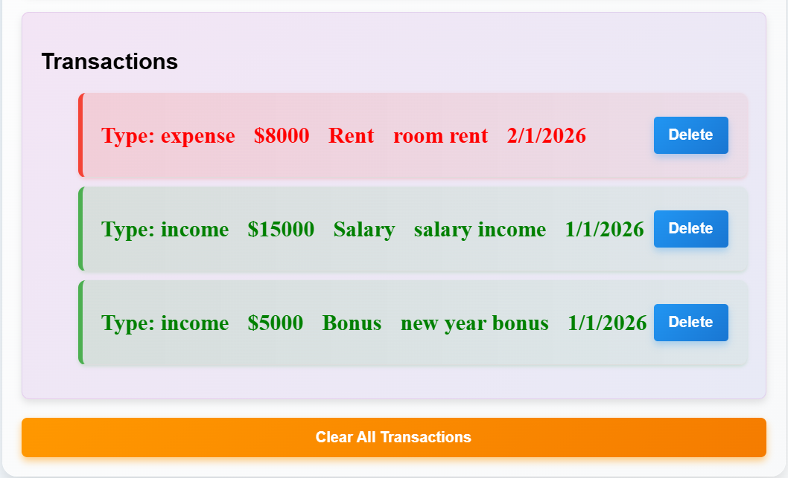

# 💰 Expense Tracker Application

A full-stack **Expense Tracker** web application built using the **MERN Stack (MongoDB, Express.js, React.js, and Node.js)**. The application enables users to efficiently manage their personal finances by recording income and expense transactions, categorizing them, and viewing an interactive financial summary.

This project was developed during my **6-month Full Stack Development Internship at Codec Technologies Pvt. Ltd.** and demonstrates practical experience in full-stack web development, RESTful API development, CRUD operations, and MongoDB integration.

---

## ✨ Key Highlights

- 📊 Interactive financial dashboard
- 💳 Income and expense management
- 📈 Automatic balance calculation
- 🗂️ Transaction history
- ⚡ Real-time data updates
- 🎯 Clean and responsive user interface
- 🌐 Full-stack MERN architecture
- 💾 MongoDB database integration

---

## 🚀 Features

- Add income transactions
- Add expense transactions
- View all transactions
- Delete transactions
- Automatically calculate total income
- Automatically calculate total expenses
- Display current account balance
- Categorize financial transactions
- RESTful API integration
- Responsive user interface

---

## 🛠️ Tech Stack

### Frontend

- React.js
- HTML5
- CSS3
- JavaScript

### Backend

- Node.js
- Express.js

### Database

- MongoDB
- Mongoose

---

## 📂 Project Structure

```text
Expense-Tracker-Application/
├── backend/
│   ├── models/
│   │   └── Transaction.js
│   ├── routes/
│   │   └── transactions.js
│   ├── server.js
│   └── package.json
│
├── frontend/
│   ├── public/
│   ├── src/
│   │   ├── components/
│   │   │   ├── Summary.js
│   │   │   ├── TransactionForm.js
│   │   │   └── TransactionList.js
│   │   ├── App.js
│   │   ├── App.css
│   │   ├── App.test.js
│   │   ├── index.js
│   │   ├── index.css
│   │   ├── logo.svg
│   │   ├── reportWebVitals.js
│   │   └── setupTests.js
│   ├── package.json
│   └── package-lock.json
│
├── screenshots/
│   ├── dashboard.png
│   ├── add-transaction.png
│   └── transactions.png
│
├── package.json
├── package-lock.json
└── README.md
```

---

## ⚙️ Installation & Setup

### Clone the Repository

```bash
git clone https://github.com/vighneshmunde/Expense-Tracker-Application.git
```

### Navigate to the Project

```bash
cd Expense-Tracker-Application
```

### Install Backend Dependencies

```bash
cd backend
npm install
```

### Install Frontend Dependencies

Open another terminal.

```bash
cd frontend
npm install
```

---

## 🗄️ Configure MongoDB

- Install MongoDB Community Server.
- Open MongoDB Compass.
- Ensure the MongoDB service is running.

Create a `.env` file inside the **backend** folder.

```env
PORT=5000
MONGO_URI=mongodb://127.0.0.1:27017/expense_tracker
```

Replace `expense_tracker` with your database name if it is different.

---

## ▶️ Running the Application

### Start Backend

Production

```bash
npm start
```

Development

```bash
npm run dev
```

### Start Frontend

```bash
cd frontend
npm start
```

### Open in Browser

```
http://localhost:3000
```

---

## 📸 Application Screenshots

### 📊 Dashboard

Monitor your financial summary with total balance, income, and expenses.

<p align="center">

</p>

---

### ➕ Add Transaction

Add income or expense transactions with amount and category.

<p align="center">

</p>

---

### 📋 Transaction History

View all recorded transactions in a clean and organized table.

<p align="center">

</p>

---

## 🎯 Learning Outcomes

During the development of this project, I gained practical experience in:

- Developing full-stack MERN applications
- Designing RESTful APIs using Express.js
- Performing CRUD operations with MongoDB
- Integrating React frontend with Express backend
- Managing application state using React
- Creating reusable React components
- Structuring scalable full-stack projects
- Building responsive web applications

---

## 🚀 Future Enhancements

- User Authentication (Login & Registration)
- Edit Existing Transactions
- Search & Filter Transactions
- Monthly Expense Reports
- Interactive Charts & Analytics
- Budget Planning
- Export Reports (PDF & Excel)
- Dark Mode
- Mobile Responsive Enhancements

---

## 💼 Internship

This project was developed as part of my **6-month Full Stack Development Internship** at **Codec Technologies Pvt. Ltd.**

---

## 👨‍💻 Author

**Vighnesh Munde**

- GitHub: https://github.com/vighneshmunde
- LinkedIn: https://www.linkedin.com/in/vighneshmunde

---

## ⭐ Support

If you found this project helpful, please consider giving it a ⭐ on GitHub.
